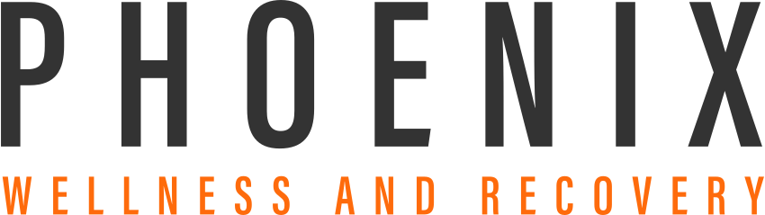
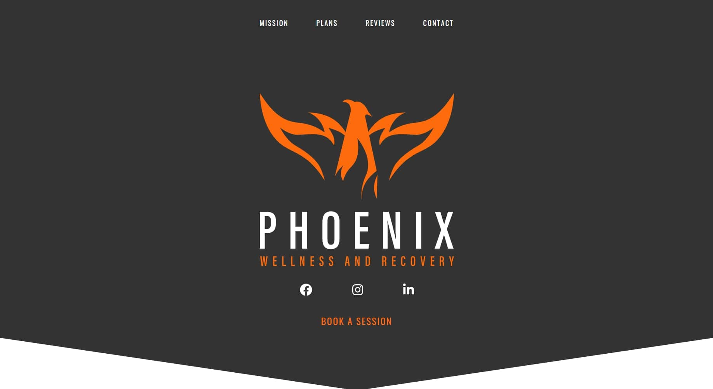

<div align="center">
  
</div>
<div align="center">
  
</div>

<h4 align="center">
 Website for <a href="https://phxrecover.com" target="_blank">Phoenix Wellness and Recovery</a>, a conditioning and high-end physical recovery company. Built with <a href="https://www.nextjs.org/" target="_blank">Next.js</a> and hosted on <a href="https://www.netlify.com/" target="_blank">Netlify</a>
</h4>

<p align="center">
  <a href="https://app.netlify.com/sites/phxrecover/deploys" target="_blank">
    
  </a>
</p>

<p align="center">
  <a href="#how-to-use">How To Use</a> •
  <a href="#color-reference">Color Reference</a> •
  <a href="#license">License</a>
</p>



## How To Use

To clone and run this application, you'll need [Git](https://git-scm.com) and [Node.js](https://nodejs.org/en/download/) (which comes with [npm](http://npmjs.com)) installed on your computer. From your command line:

```bash
# Clone this repository
$ git clone https://github.com/oarnosa/phoenix-wellness-next.git

# Go into the repository
$ cd phoenix-wellness-next

# Install dependencies
$ npm install

# Run the app
$ npm run dev
```

## Color Reference

<table style="width:100%">
  <tr>
    <th>Color</th>
    <th>RGB</th>
    <th>HEX</th>
  </tr>
  <tr align=center>
    <td>White</td>
    <td>rgb(255, 255, 255)</td>
    <td>#FFFFFF</td>
  </tr>
  <tr align=center>
    <td>Dark Gray</td>
    <td>rgb(51, 51, 51)</td>
    <td>#333333</td>
  </tr>
  <tr align=center>
    <td>Light Gray</td>
    <td>rgb(138, 140, 141)</td>
    <td>#8A8C8D</td>
  </tr>
  <tr align=center>
    <td>Orange</td>
    <td>rgb(254, 107, 12)</td>
    <td>#FE6B0C</td>
  </tr>
</table>

## License

- **[MIT license](http://opensource.org/licenses/mit-license.php)**
- While the code is free to use and distribute as it was built by myself, <a href="http://orlandoarnosa.com" target="_blank">Orlando Arnosa</a>, all images, videos, logos, and assets are owned by <a href="http://phxrecover.com" target="_blank">Phoenix Wellness and Recovery</a>.
